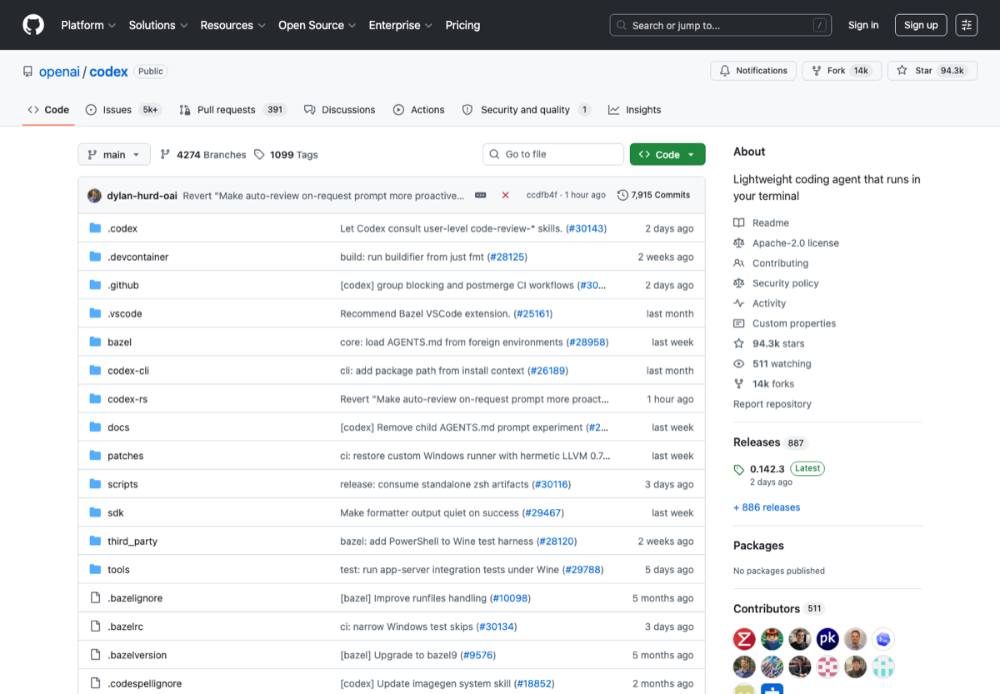

# 中文 AI 编程工具箱

这几年写代码的工具变化太快了。以前大家争的是补全准不准，现在更麻烦，开始争 agent 能不能读仓库、会不会乱改文件、跑不跑测试、token 钱到底烧到哪里去。这个仓库只留下我觉得中文用户真的会用到的入口。

如果你只是写课程作业，先别急着把所有 agent 都装一遍；如果你已经在维护 repo，那终端 agent 和 Git diff 的配合反而比 IDE 花活更重要。

## 先看这几个

OpenAI Codex CLI / Claude Code / Gemini CLI / Cursor

先从 Codex CLI / Claude Code / Cursor / Cline 四个方向各试一个小任务。

## 入口

| 名称 | 我为什么留它 |
| --- | --- |
| [OpenAI Codex CLI](https://github.com/openai/codex) | 终端 coding agent，适合本地仓库修改、测试、PR 小修。 |
| [Claude Code](https://docs.anthropic.com/en/docs/claude-code/overview) | Claude 生态 coding agent，适合长上下文和复杂任务拆解。 |
| [Gemini CLI](https://github.com/google-gemini/gemini-cli) | Google Gemini 生态终端 agent，开源且热度高。 |
| [Cursor](https://cursor.com/) | AI-first editor，适合想要开箱即用 IDE 体验的人。 |
| [Cline](https://github.com/cline/cline) | VS Code 内开源 autonomous coding agent。 |
| [Aider](https://github.com/Aider-AI/aider) | Git/diff 驱动的经典终端 AI pair programmer。 |
| [Continue](https://github.com/continuedev/continue) | 开源 AI coding assistant 平台，适合团队自定义。 |
| [Qwen Code](https://github.com/QwenLM/qwen-code) | Qwen 生态终端 coding agent，中文用户值得关注。 |

## 我的使用顺序

- 先选一种工作流：终端 agent、AI IDE、VS Code 插件。
- 小仓库试用：让工具读 README、修 bug、跑测试。
- 确认成本和权限后再交给它改大仓库。

## 别踩坑

- 不要把生产密钥交给 agent。
- 不要只看 star，要看是否适合你的编辑器和模型生态。

## 截图来源

这张图来自公开页面：[https://github.com/openai/codex](https://github.com/openai/codex)。如果页面改版，截图可能会和当前官网略有出入。

## 维护方式

链接数据放在 [`data/links.json`](data/links.json)。我倾向于少而准：入口失效就换，说明过时就改，不把这里做成什么都往里塞的大杂烩。

## License

MIT. 第三方商标、页面截图和网站内容归原权利方所有；本仓库只做中文导航和使用笔记。
